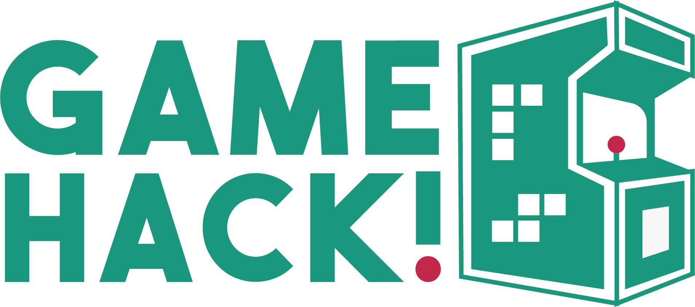
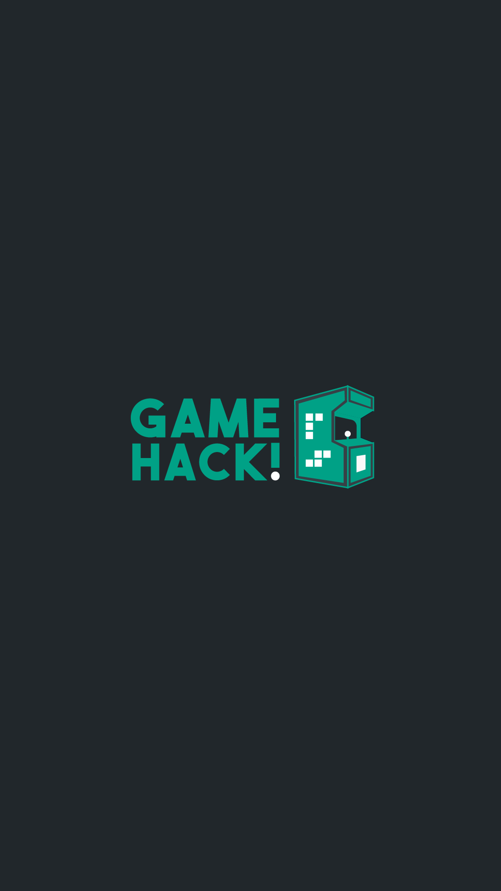
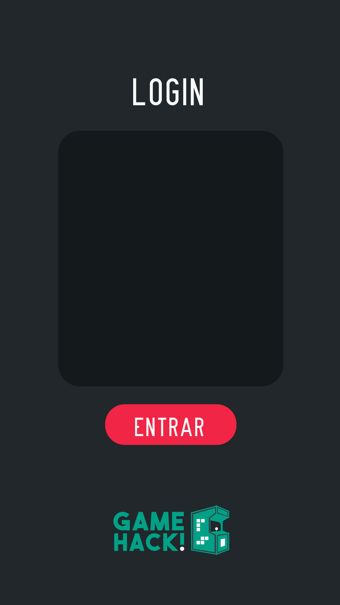
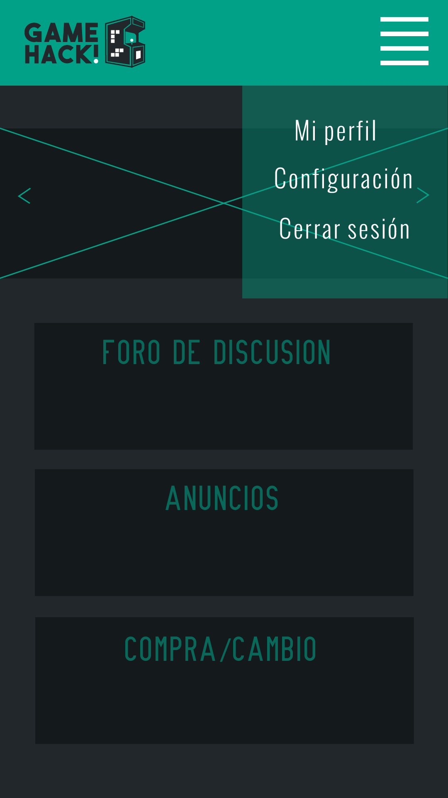
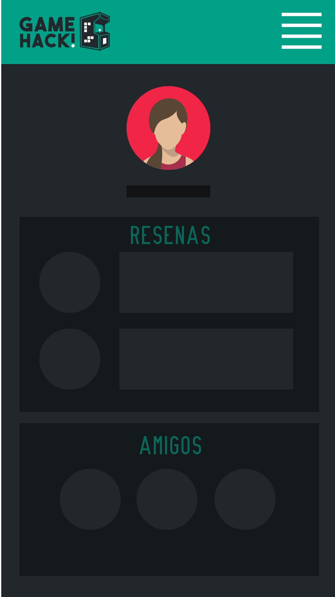

# Gamehack

* **Track:** _Common Core_
* **Hackaton**

***

## MARTES 06/02/2018
### Flujo de trabajo martes en la mañana

* **Toma de decisión**
* **Lluvia de ideas**
* **Organización de equipo**
* **Sketching a lápiz**
* **Búsqueda de API's**
* **Creación de repositorio y README**

***

## Toma de decisión en equipo

Para este proyecto se tomo la decisión en squad de realizar una red social de gamers, ya que al analizar la información que buscamos vimos que no hay muchas redes para esta temática, por lo que nos decidimos a realizarla.

## Lluvia de ideas en equipo

Todas las integrantes del squad comentamos sobre como nos gustaría que fluyera la aplicación.

## Organización de equipo

Para el proyecto nos organizaremos por medio de un rotafolio donde colocaremos las ideas que vayan saliendo y un tablero en Trello

## Sketching a lápiz

## Búsqueda de API's (Jess, Ingrid y Adri)

Se comienza a buscar en internet todas las API's que pueden ayudar a mejorar el flujo de  trabajo y el como se van a implementar a nuestro proyecto.

## Creación de repositorio y README (Kary)

Se crea el repositorio en Github y se inicializa con el README del día.

### Flujo de trabajo martes en la tarde

* **Realización de encuesta**
* **Mejoras en sketch**
* **Realización de BD**
* **Investigación de API Twitch autenticación**
* **Búsqueda de tipografías y colores adecuados**
* **Actualización README**

***
## Realización de encuesta (Adri)

Se realizara una pequeña encuesta la cual será lanzada a diferentes canales de gamers conocidos vía Whatsapp

## Mejoras de skecth(Ingrid)

Se aterrizará de manera definida la idea y se plamará en papel y lápiz con las siguientes pantallas:

## Realización de BD (Ingrid)

Para el proyecto se realizarán 2 bases de datos con pocos datos para demostrarla funcionalidad de la app

* Juegos
* Usuarios

## Investigación API Twitch(Jess)

se buscará autenticar la cuenta a traves de la API de Twitch

## Búsqueda de tipografía y colores(kary)

Se buscará el contenido más adecuado de la temática, que sea llamativo y que impacte a los usuarios

## Actualización README(Kary)

Se actualizó el README con las tareas asignadas hasta el momento

********

## MIERCOLES 07/02/2018
### Flujo de trabajo miércoles en la mañana

* **Información de API's de autenticación**
* **Información de API's de buscador**
* **Sketch Digital**
* **Inicio de maquetación**
* **Actualización README**

***

## Información de API's de autenticación(Jess)

Se buscará la forma de hacer login con los usuarios que ya cuentan con cuenta en Twitch

## Información de API's de buscador (Ingrid)

Se busco una API que hiciera búsquedas a través de Google con las palabras clave de videojuegos

## Sketch Digital(Adri)

Se crearán las pantallas que se desean tener en la aplicación a través de AI al igual que el logo

## Inicio de maquetación(Kary)

Se inicia la maquetación de la vista de información donde se tendrán los últimos lanzamientos, foro,etc

## Actualización README 

Actualización de README con avances del proyecto

***

# Link de Trello

https://trello.com/b/VwZrYUPV/organizaci%C3%B3n-del-hackaton

# Link de Encuesta

https://docs.google.com/forms/d/e/1FAIpQLSfuc8noDS2kLyr5ZPA_O9FXThQ1CgKHZ9mg9F5WpQisIbM9ng/viewform

